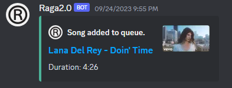
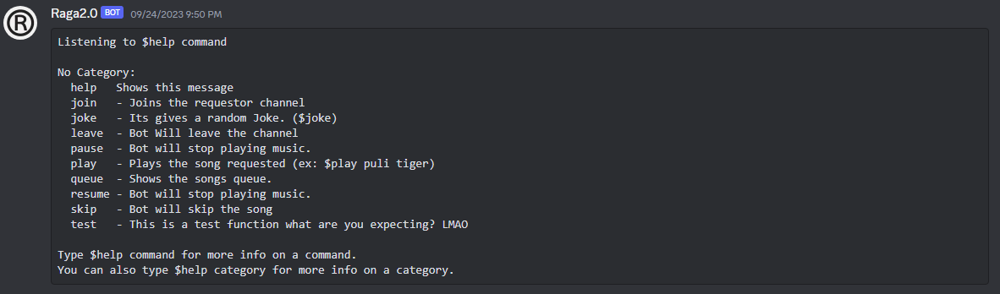
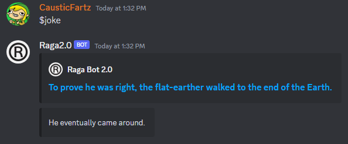
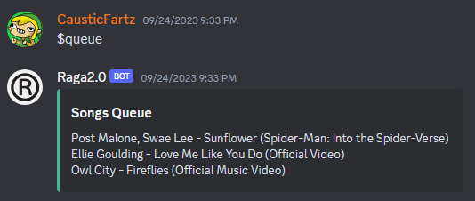
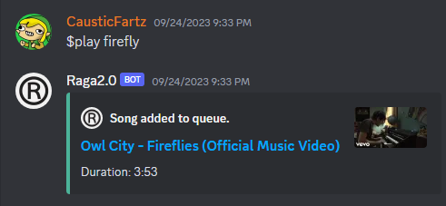

# RagaBot2.0
Raga Bot 2.0 Github Repo

## Config and personalization
###
Values.py holds all the variables. customize it to your liking.

Storage holds the {id}.mp3 files | Upcoming version contains options to store in database with .data file format

keep_alive.py uses flask to host on the replit.

## Optional files
### Since, some files are unecessary Relpit forks might need to be cleaned up. Below mentioned files are optional for debugging
1. queue_persistent.txt
2. junk*.py
3. youtube_dl (subfolder with a modified version 2021.12.17) Retain this folder incase of faing uploder ID issue. (https://github.com/ytdl-org/youtube-dl/issues/31530#issue-1587746229)
4. youtube_dl.zip
5. LOGS (Public logs for debugging and issues)

## Issues
### Please raise issues on github repo

## Updates and archive
### Older stable vesions of the bots are availabe on replit. 
~~Patches and depricated vesions are available on the bot page for testing.~~
